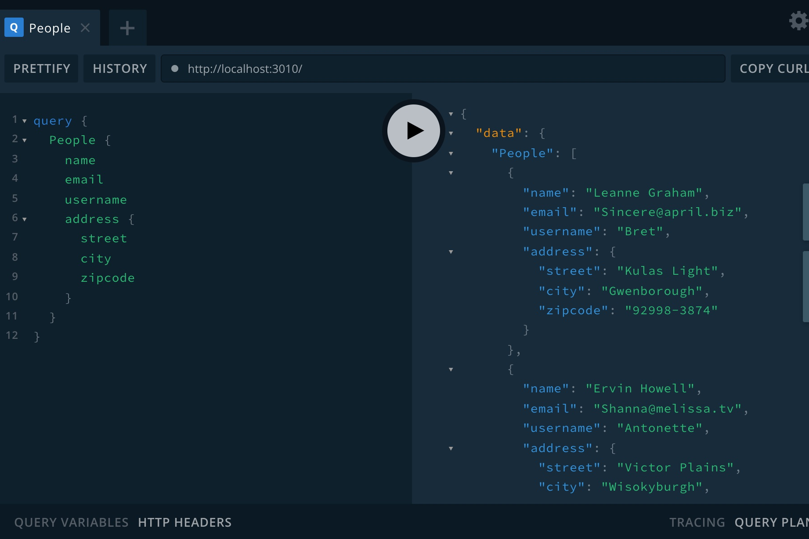

# Apollo GraphQL + Redis + Docker Starter Kit

## Features
* Apollo GraphQL
* Redis cache to optimize the peformance
* Docker integration to fire up the entire stack in minutes

## Installation

`docker-compose up -d`


Example :
Go to:  http://localhost:3010/
```
query {
  People {
    name
    email
    username
    address {
      street
      city
      zipcode
    }
  }
}
```





Credit: https://www.apollographql.com/docs/apollo-server/getting-started/
